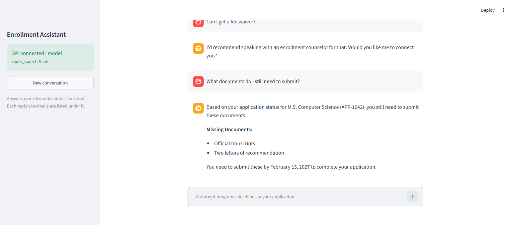

# Student Enrollment Assistant Agent

A conversational AI agent for a university admissions office. It answers prospective
students' questions about **programs**, **deadlines** and **application status** by calling
tools over mock data. It never answers those facts from the LLM's own knowledge. It keeps
context within a session, and it hands off to an enrollment counselor when a question is
outside what its tools cover.

Built with **LangGraph + LangChain** on **Python 3.12**, using spec-driven development.
It runs on the **OpenAI API** or a **local LLM** (LM Studio / Ollama) with no code changes.
You can use it from a terminal chat, a **FastAPI** HTTP API, or a **Streamlit** web UI, and
the API and UI can run in **Docker**.

- Case study brief: [assets/Agentic AI Case Study.pdf](assets/Agentic%20AI%20Case%20Study.pdf)
- Demo log (5-turn case-study conversation): [docs/demo_log_lmstudio.md](docs/demo_log_lmstudio.md)



## How it works

```
 browser  ─► Streamlit UI ─HTTP─► FastAPI ─┐
                                           ├─► EnrollmentAgent.chat / .achat
 terminal ─► CLI / demo script ────────────┘   (message, session_id)
                                     │
                     ┌───────────────▼────────────────┐
                     │  LangGraph StateGraph          │
                     │                                │
                     │  START ─► agent ─► END         │
                     │            ▲  │ tool calls     │
                     │            │  ▼                │
                     │           tools (ToolNode)     │
                     │                                │
                     │  memory: checkpointer / thread │
                     └───────┬───────────────┬────────┘
                             │               │
                  ChatOpenAI (any       get_program_info
                  OpenAI-compatible     get_deadlines
                  endpoint)             check_application_status ─► mock data
```

1. **Reason**: the `agent` node sends the conversation, the system prompt and the tool
   schemas to the LLM.
2. **Act**: if the LLM requests tool calls, the `tools` node runs them. Several calls in
   one step are supported.
3. **Observe**: tool results go back to the LLM, and the loop repeats until the LLM
   answers in plain text. The loop is capped at `AGENT_MAX_ITERATIONS` model calls per turn.
4. **Remember**: a LangGraph checkpointer keeps the full history for each session, so
   "that" and a previously given applicant ID are resolved without asking again.
5. **Escalate**: for questions the tools can't answer, the agent replies: *"I'd recommend
   speaking with an enrollment counselor for that. Would you like me to connect you?"*

### Tools

| Tool | Input | Returns |
|---|---|---|
| `get_program_info` | `program_name` | Program name, duration, tuition, prerequisites |
| `check_application_status` | `applicant_id` | Applicant name, program, status, next step, missing documents |
| `get_deadlines` | `program_name` | Application deadline, document deadline, decision date |

Program names match loosely: `"computer science"` returns both CS programs, and
`"all programs"` lists everything. Unknown names or IDs return a structured `not_found`
result instead of raising an error.

Mock data: 4 programs (B.S./M.S. Computer Science, MBA, B.S. Mechanical Engineering)
and 4 applicants (`APP-1042` … `APP-1045`). See [data.py](src/enrollment_agent/data.py).

## Setup

Requires [uv](https://docs.astral.sh/uv/). uv installs Python 3.12 if it is missing.

```powershell
uv sync
Copy-Item .env.example .env      # macOS/Linux: cp .env.example .env
```

### Choose an LLM provider

Any OpenAI-compatible endpoint works. Set it in `.env`:

| Provider | `LLM_BASE_URL` | `LLM_MODEL` | `OPENAI_API_KEY` |
|---|---|---|---|
| LM Studio (default) | `http://localhost:1234/v1` | `qwen_qwen3.5-4b` | any value, e.g. `lm-studio` |
| OpenAI | `https://api.openai.com/v1` | `gpt-4o-mini` | your key |
| Ollama | `http://localhost:11434/v1` | `qwen2.5-coder:7b` | any value, e.g. `ollama` |

The local model must support tool calling. `qwen_qwen3.5-4b` passes the full demo on a
4 GB GPU.

To keep several providers side by side, create extra files such as `.env.openai` and pass
`--env-file .env.openai`. Files named `.env.*` are git-ignored.

## Usage

**Chat in the terminal**

```powershell
uv run enrollment-agent            # add --verbose to see tool calls and results
```

Type `exit` or `quit` to end the session.

**Web UI (FastAPI + Streamlit)**

Start the API in one terminal and the UI in another:

```powershell
uv run enrollment-api                                        # http://127.0.0.1:8000 (docs at /docs)
uv run streamlit run src/enrollment_agent/streamlit_app.py   # http://localhost:8501
```

- The UI calls the API at `API_URL`, which defaults to `http://localhost:8000`. Example:
  `$env:API_URL="http://127.0.0.1:9000"`.
- The API takes `--host`, `--port` and `--env-file`, e.g. `--env-file .env.openai`.
- Each reply in the UI has a **Tool calls** panel showing which tools ran, with their
  arguments and results. **New conversation** starts a fresh session.
- Sessions live in the API process's memory and are cleared when it restarts.

API example:

```powershell
$r = Invoke-RestMethod http://127.0.0.1:8000/chat -Method Post -ContentType application/json `
       -Body '{"message": "My ID is APP-1042. What is my status?"}'
Invoke-RestMethod http://127.0.0.1:8000/chat -Method Post -ContentType application/json `
       -Body (@{message = "Which documents are missing?"; session_id = $r.session_id} | ConvertTo-Json)
```

| Endpoint | Request | Response |
|---|---|---|
| `POST /chat` | `{message, session_id?}` | `{session_id, reply, tool_events[{name, args, result}]}` |
| `GET /health` | | `{status: "ok", model}` |

An empty message returns 422. An unreachable LLM returns 503, and other LLM errors return 502.

**Docker (API + UI)**

Requires Docker Desktop, or Docker Engine with Compose v2. The LLM keeps running outside
Docker.

```powershell
docker compose up --build -d     # UI http://localhost:8501 · API http://localhost:8000
docker compose logs -f api       # follow API logs
docker compose down              # stop and remove the containers
```

- Both services run from one image: a slim Python 3.12 image with dependencies from
  `uv.lock` and no dev packages, running as a non-root user. `.env` files are never copied
  into the image.
- LLM settings come from `.env`. Inside a container `localhost` means the container itself,
  so the endpoint is set by `DOCKER_LLM_BASE_URL`. By default that is LM Studio on the host,
  at `http://host.docker.internal:1234/v1`.
- To use OpenAI instead, put your key in `.env` and add
  `DOCKER_LLM_BASE_URL=https://api.openai.com/v1`.
- If the API can't reach LM Studio, enable **Serve on Local Network** in LM Studio's server
  settings.
- Ports are published on `127.0.0.1` only. The UI starts once the API reports healthy.

**Run the case-study demo and write a log**

```powershell
uv run python scripts/run_demo.py                                   # provider from .env → docs/demo_log.md
uv run python scripts/run_demo.py --env-file .env.openai            # OpenAI
uv run python scripts/run_demo.py --output docs/demo_log_lmstudio.md
```

**Tests**

```powershell
uv run pytest            # 115 offline tests (fake model, stub API client), no LLM or network needed
uv run pytest -m live    # 5 end-to-end checks of the demo against the configured LLM
```

## Demo conversation

| Turn | User | Agent behavior |
|---|---|---|
| 1 | Hi, what programs do you offer in computer science? | `get_program_info("computer science")`: lists B.S. and M.S. CS |
| 2 | What's the application deadline for that? | Resolves "that" from turn 1, then `get_deadlines` for both programs |
| 3 | I already applied. My ID is APP-1042. What's my status? | `check_application_status("APP-1042")`: Documents Pending |
| 4 | Can I get a fee waiver? | No tool; escalates to an enrollment counselor |
| 5 | What documents do I still need to submit? | Answers from session memory without asking for the ID again |

The full input/output log, including every tool call and result, is in
[docs/demo_log_lmstudio.md](docs/demo_log_lmstudio.md). It was recorded with the local
`qwen_qwen3.5-4b` model. To record one with OpenAI, run the demo with `--env-file .env.openai`.

## Project layout

```
specs/                  requirements.md → design.md → tasks.md (spec-driven development)
src/enrollment_agent/
  data.py               mock programs, deadlines, applicants
  tools.py              lookup functions + LangChain @tool wrappers
  prompts.py            system prompt and escalation message
  graph.py              LangGraph StateGraph (agent + ToolNode, memory, iteration cap)
  agent.py              EnrollmentAgent facade (sync chat + async achat), UI-independent
  llm.py, config.py     ChatOpenAI factory, .env settings
  cli.py                terminal chat
  demo.py               demo turns, runner, Markdown log
  api.py                FastAPI app: POST /chat, GET /health
  api_client.py         HTTP client used by the UI
  streamlit_app.py      Streamlit chat UI
scripts/run_demo.py     demo entry point
Dockerfile, compose.yaml  one image; api + ui services
tests/                  unit, graph, API, UI (AppTest), CLI and live tests
docs/                   demo logs and UI screenshot
```

## Development process

The project follows spec-driven development. Each stage was reviewed before the next began:

1. [Requirements](specs/requirements.md): functional requirements with numbered acceptance criteria.
2. [Design](specs/design.md): architecture, tool contracts, graph, memory, decisions.
3. [Tasks](specs/tasks.md): test-first tasks, each traced back to its requirements.

Tests are written from the acceptance criteria before the implementation.

## Roadmap

- Persistent sessions via a SQLite checkpointer.
- Streaming replies (Server-Sent Events) for faster perceived responses.
- Smaller UI image (a UI-only dependency set without LangChain/LangGraph).
